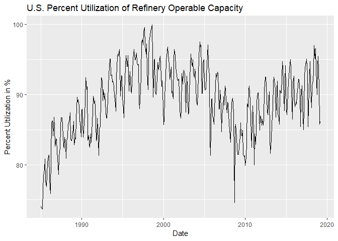

Supervised Learning with EIA Data
================

The following is a simple machine learning project that leverages on the
[‘caret’](http://topepo.github.io/caret/index.html) package in R and
fundamental supply and demand data from the U.S. EIA to explore
numerical relationships in energy markets.

The objective will be to explore if fundamental variables such as U.S.
Oil Production and Consumption have a meaningful predictive relationship
with the prices of U.S. Crude Oil benchmarks such as West Texas
Intermediate Crude.

### 1\. Import Libraries

``` r
# Import all required libraries
library(broom)
library(caret)
```

    ## Loading required package: lattice

    ## Loading required package: ggplot2

    ## Registered S3 methods overwritten by 'ggplot2':
    ##   method         from 
    ##   [.quosures     rlang
    ##   c.quosures     rlang
    ##   print.quosures rlang

``` r
library(knitr)
library(PerformanceAnalytics)
```

    ## Loading required package: xts

    ## Loading required package: zoo

    ## 
    ## Attaching package: 'zoo'

    ## The following objects are masked from 'package:base':
    ## 
    ##     as.Date, as.Date.numeric

    ## Registered S3 method overwritten by 'xts':
    ##   method     from
    ##   as.zoo.xts zoo

    ## 
    ## Attaching package: 'PerformanceAnalytics'

    ## The following object is masked from 'package:graphics':
    ## 
    ##     legend

``` r
library(Quandl)
library(sigr)
library(tidyverse)
```

    ## -- Attaching packages ------------------------------------------------------------------------------- tidyverse 1.2.1 --

    ## v tibble  2.1.1     v purrr   0.3.2
    ## v tidyr   0.8.3     v dplyr   0.8.1
    ## v readr   1.3.1     v stringr 1.4.0
    ## v tibble  2.1.1     v forcats 0.4.0

    ## -- Conflicts ---------------------------------------------------------------------------------- tidyverse_conflicts() --
    ## x dplyr::filter() masks stats::filter()
    ## x dplyr::first()  masks xts::first()
    ## x dplyr::lag()    masks stats::lag()
    ## x dplyr::last()   masks xts::last()
    ## x purrr::lift()   masks caret::lift()

``` r
# Import data from the EIA Database in Quandl
wti <- Quandl(code = "CHRIS/ICE_T1", type = "xts")  # West Texas Intermediate Traded Prices
inv <- Quandl(code = "EIA/STEO_COSXPUS_M", type = "xts")  # U.S. Crude Oil Inventories
prod <- Quandl(code = "EIA/STEO_COPRPUS_M", type = "xts")  # U.S. Crude Oil Production
impts <- Quandl(code = "EIA/PET_MCEIMUS1_M", type = "xts")  # U.S. Crude Oil Imports
refy <- Quandl(code = "EIA/PET_MOPUEUS2_M", type = "xts")  # U.S. Refinery Percent Utilization Rates
cons <- Quandl(code = "EIA/STEO_TETCFUEL_M", type = "xts")  # U.S. Total Energy Consumption
gdp <- Quandl(code = "EIA/STEO_GDPQXUS_PCT_M", type = "xts")  # U.S. Real GDP

# Examine the structure of the 'wti' xts object
str(wti)
```

    ## An 'xts' object on 2006-02-03/2019-06-24 containing:
    ##   Data: num [1:3409, 1:11] 64.8 66.3 64.8 63 62.7 ...
    ##  - attr(*, "dimnames")=List of 2
    ##   ..$ : NULL
    ##   ..$ : chr [1:11] "Open" "High" "Low" "Settle" ...
    ##   Indexed by objects of class: [Date] TZ: UTC
    ##   xts Attributes:  
    ##  NULL

``` r
head(wti)
```

    ##             Open  High   Low Settle Change Wave Volume
    ## 2006-02-03 64.77 65.48 63.93  65.37     NA   NA  21966
    ## 2006-02-06 66.35 66.50 64.77  65.11  -0.26   NA  20387
    ## 2006-02-07 64.82 64.90 62.81  63.09  -2.02   NA  29434
    ## 2006-02-08 62.96 63.44 62.29  62.55  -0.54   NA  27539
    ## 2006-02-09 62.68 63.73 62.38  62.62   0.07   NA  27492
    ## 2006-02-10 62.87 63.00 61.35  61.84  -0.78   NA  21129
    ##            Prev. Day Open Interest EFP Volume EFS Volume Block Volume
    ## 2006-02-03                   11070          0          0            0
    ## 2006-02-06                   10998          0          0            0
    ## 2006-02-07                   13611          0          0            0
    ## 2006-02-08                   13583          0          0            0
    ## 2006-02-09                   21976          0          0            0
    ## 2006-02-10                   21733          0          0            0

``` r
tail(wti)
```

    ##             Open  High   Low Settle Change  Wave Volume
    ## 2019-06-17 52.33 52.73 51.59  51.93  -0.58 52.17  33226
    ## 2019-06-18 51.81 54.30 51.48  53.90   1.97 53.19  22069
    ## 2019-06-19 54.40 54.67 53.52  53.97  -0.14 54.02  70447
    ## 2019-06-20 54.62 57.36 54.54  57.07   3.10 56.54  81309
    ## 2019-06-21 57.42 57.96 56.66  57.43   0.36 57.44  50814
    ## 2019-06-24 57.75 58.21 56.75  57.90   0.47 57.52  53476
    ##            Prev. Day Open Interest EFP Volume EFS Volume Block Volume
    ## 2019-06-17                   43745         NA         NA         2883
    ## 2019-06-18                   36665         NA         NA         4246
    ## 2019-06-19                   81696         NA         NA         1048
    ## 2019-06-20                   84275         NA         NA         2064
    ## 2019-06-21                   82928         NA         NA         2044
    ## 2019-06-24                   78272         NA         NA         1370

Quandl Data on WTI Traded Futures roughly extends from Feb 2006 to Jun
2019.

### 2\. Basic Exploratory Data Analysis

``` r
# Plot a time series chart of West Texas Intermediate Closing Prices from 2006 to 2019
ggplot(data = wti, mapping = aes(x= index(wti), y = Settle)) +
  geom_line() +
  labs(title = "West Texas Intermediate Crude Oil Prices", subtitle = "From 2006-02-03 to 2019-06-14") +
  xlab("Date") +
  ylab("Price")
```

<!-- -->

The price series of WTI Crude Oil broadly reflects trends in energy
markets: a large rally and decline post-GFC, mean-reverting markets
between 2010 and 2015, the infamous collapse to \~$30/bbl in Q1 2016 and
associaated volatility between 2018 and 2019.

``` r
# Examine the structure of the 'prod' xts object
str(prod)
```

    ## An 'xts' object on Jan 1990/Dec 2020 containing:
    ##   Data: num [1:372, 1] 7.55 7.5 7.43 7.41 7.33 ...
    ##   Indexed by objects of class: [yearmon] TZ: UTC
    ##   xts Attributes:  
    ##  NULL

``` r
head(prod)
```

    ##              [,1]
    ## Jan 1990 7.546173
    ## Feb 1990 7.497242
    ## Mar 1990 7.433341
    ## Apr 1990 7.407173
    ## May 1990 7.328342
    ## Jun 1990 7.105838

``` r
tail(prod)
```

    ##              [,1]
    ## Jul 2020 13.21887
    ## Aug 2020 13.32012
    ## Sep 2020 13.41177
    ## Oct 2020 13.31354
    ## Nov 2020 13.51125
    ## Dec 2020 13.50069

``` r
names(prod) <- "Production"

ggplot(data = prod, mapping = aes(x = index(prod), y = Production)) +
  geom_line() +
  labs(title = "U.S. Crude Oil Production, Monthly") +
  xlab("Date") +
  ylab("Production in Million Barrels Per Day")
```

    ## Don't know how to automatically pick scale for object of type yearmon. Defaulting to continuous.

<!-- -->

A quick analaysis of the time series plot of U.S. Crude Oil Production
highlights a number of interesting features: amongst them, the sharp
increase in monthly production numbers after 2010 - a likely effect of
the U.S. Shale Revolution, a dramatic increase in “tight oil” supplies
owing to fracking and horizontal drilling.

``` r
# Examine the structure of the 'refy' xts object
str(refy)
```

    ## An 'xts' object on Jan 1985/Mar 2019 containing:
    ##   Data: num [1:411, 1] 74 73.8 73.7 76.5 78.4 79.3 80.8 77.7 76.9 78.6 ...
    ##   Indexed by objects of class: [yearmon] TZ: UTC
    ##   xts Attributes:  
    ##  NULL

``` r
head(refy)
```

    ##          [,1]
    ## Jan 1985 74.0
    ## Feb 1985 73.8
    ## Mar 1985 73.7
    ## Apr 1985 76.5
    ## May 1985 78.4
    ## Jun 1985 79.3

``` r
tail(refy)
```

    ##          [,1]
    ## Oct 2018 90.0
    ## Nov 2018 94.1
    ## Dec 2018 95.4
    ## Jan 2019 91.1
    ## Feb 2019 85.8
    ## Mar 2019 86.1

``` r
names(refy) <- "Utilization"

ggplot(data = refy, mapping = aes(x = index(refy), y = Utilization)) +
  geom_line() +
  labs(title = "U.S. Percent Utilization of Refinery Operable Capacity") +
  xlab("Date") +
  ylab("Percent Utilization in %")
```

    ## Don't know how to automatically pick scale for object of type yearmon. Defaulting to continuous.

<!-- -->

One of the more interesting patterns in the energy market is the
presence of seasonality in refinery utilization rates: utilization rates
sharply increase in the summer driving months owing to increased motor
gasoline demand. Conversely, run rates tend to decrease in the fall
owing to turnarounds and weaker product demand.

### 3\. Data Preprocessing

``` r
# Convert the daily WTI time series to a monthly time series on 'Settle'
wti_monthly <- to.monthly(wti$Settle)

# Examine the monthly WTI xts object
str(wti_monthly)
```

    ## An 'xts' object on Feb 2006/Jun 2019 containing:
    ##   Data: num [1:161, 1:4] 65.4 62 66.7 73.7 70.3 ...
    ##  - attr(*, "dimnames")=List of 2
    ##   ..$ : NULL
    ##   ..$ : chr [1:4] "wti$Settle.Open" "wti$Settle.High" "wti$Settle.Low" "wti$Settle.Close"
    ##   Indexed by objects of class: [yearmon] TZ: UTC
    ##   xts Attributes:  
    ##  NULL

``` r
head(wti_monthly)
```

    ##          wti$Settle.Open wti$Settle.High wti$Settle.Low wti$Settle.Close
    ## Feb 2006           65.37           65.37          57.65            61.41
    ## Mar 2006           61.97           67.15          59.96            66.63
    ## Apr 2006           66.74           75.17          66.23            71.88
    ## May 2006           73.70           74.61          68.53            71.29
    ## Jun 2006           70.34           73.93          68.56            73.93
    ## Jul 2006           74.04           77.03          72.66            74.40

``` r
tail(wti_monthly)
```

    ##          wti$Settle.Open wti$Settle.High wti$Settle.Low wti$Settle.Close
    ## Jan 2019           46.54           54.23          46.54            53.79
    ## Feb 2019           55.26           57.26          52.41            57.22
    ## Mar 2019           55.80           60.23          55.80            60.14
    ## Apr 2019           61.59           66.30          61.59            63.91
    ## May 2019           63.60           63.60          53.50            53.50
    ## Jun 2019           53.25           57.90          51.14            57.90

``` r
# Combine all time series into a single object for analysis
oil <- merge(wti_monthly, inv, prod, impts, refy, cons, gdp)

# Drop the Open, High, Low columns from oil
oil <- oil[, -c(1, 2, 3)]

# Filter to a subset with available data on all variables
oil <- oil["2006-02/2019-03"]

# Rename columns
names(oil) <- c("price", "inv", "prod", "impts", "util", "cons", "gdp")

# Conver the xts object to a data.frame
oil <- as.data.frame(oil)

# Examine the oil data.frame object
str(oil)
```

    ## 'data.frame':    158 obs. of  7 variables:
    ##  $ price: num  61.4 66.6 71.9 71.3 73.9 ...
    ##  $ inv  : num  326 326 331 324 321 ...
    ##  $ prod : num  5.03 5.03 5.08 5.15 5.16 ...
    ##  $ impts: num  279152 301243 294777 318687 321369 ...
    ##  $ util : num  86.5 85.8 88 91.2 93 92.5 93.2 93 87.9 88 ...
    ##  $ cons : num  8.21 8.61 7.73 7.98 8.16 ...
    ##  $ gdp  : num  3.37 3.34 3.28 3.14 2.94 ...

``` r
head(oil)
```

    ##          price     inv     prod  impts util     cons      gdp
    ## Feb 2006 61.41 326.383 5.031930 279152 86.5 8.209513 3.370957
    ## Mar 2006 66.63 326.417 5.027168 301243 85.8 8.605115 3.343685
    ## Apr 2006 71.88 331.258 5.081652 294777 88.0 7.728664 3.275569
    ## May 2006 71.29 324.286 5.150561 318687 91.2 7.975749 3.138970
    ## Jun 2006 73.93 320.523 5.162796 321369 93.0 8.164176 2.944629
    ## Jul 2006 74.40 315.387 5.094173 317114 92.5 8.651295 2.471555

``` r
tail(oil)
```

    ##          price     inv     prod  impts util     cons      gdp
    ## Oct 2018 65.31 432.459 11.55895 226679 90.0 8.094910 2.941433
    ## Nov 2018 50.93 448.607 11.92607 224694 94.1 8.476201 2.961309
    ## Dec 2018 45.41 441.794 11.96301 220059 95.4 9.042961 3.011283
    ## Jan 2019 53.79 448.804 11.86025 233126 91.1 9.509997 3.166493
    ## Feb 2019 57.22 451.728 11.66446 186243 85.8 8.358039 3.219673
    ## Mar 2019 60.14 459.322 11.90481 209541 86.1 8.713408 3.246309

### 4\. Univariate Linear Regression

``` r
# Explore Linear Regression with one variable: Production
fmla_lm <- as.formula("price ~ prod")

# Train a Linear Regression model
model_lm <- lm(formula = fmla_lm, data = oil)

# Examine the results of the model fit
summary(model_lm)
```

    ## 
    ## Call:
    ## lm(formula = fmla_lm, data = oil)
    ## 
    ## Residuals:
    ##     Min      1Q  Median      3Q     Max 
    ## -42.542 -16.714  -2.648  16.056  55.778 
    ## 
    ## Coefficients:
    ##             Estimate Std. Error t value Pr(>|t|)    
    ## (Intercept) 107.4593     5.7481  18.695  < 2e-16 ***
    ## prod         -4.5229     0.7615  -5.939  1.8e-08 ***
    ## ---
    ## Signif. codes:  0 '***' 0.001 '**' 0.01 '*' 0.05 '.' 0.1 ' ' 1
    ## 
    ## Residual standard error: 20.1 on 156 degrees of freedom
    ## Multiple R-squared:  0.1844, Adjusted R-squared:  0.1792 
    ## F-statistic: 35.28 on 1 and 156 DF,  p-value: 1.798e-08

``` r
glance(model_lm)
```

    ## # A tibble: 1 x 11
    ##   r.squared adj.r.squared sigma statistic p.value    df logLik   AIC   BIC
    ##       <dbl>         <dbl> <dbl>     <dbl>   <dbl> <int>  <dbl> <dbl> <dbl>
    ## 1     0.184         0.179  20.1      35.3 1.80e-8     2  -697. 1401. 1410.
    ## # ... with 2 more variables: deviance <dbl>, df.residual <int>

``` r
wrapFTest(model_lm)
```

    ## [1] "F Test summary: (R2=0.1844, F(1,156)=35.28, p<1e-05)."

A quick regression exercise with the lm() function shows that predicting
WTI prices with just U.S. Production numbers leads to a mere R-Squared
Value of \~0.18. (Roughly 18% of the variance in WTI prices is explained
by the linear model)

The coefficient on the ‘prod’ variable is, however, highly significant
with a p-value of 1.8e-08. This suggests that there may be some
predictive value in analyzing U.S. Crude Oil Production numbers.

``` r
# Visualize a linear model between price and prod
oil$pred <- predict(model_lm)

# Plot the Actual Prices against the Model's Predicted Prices
ggplot(data = oil, mapping = aes(x = pred, y = price)) +
  geom_point() +
  geom_abline(color = "darkblue") +
  labs(title = "Predicted WTI Price versus Actual WTI Price", subtitle = "In-Sample Predictions") +
  xlab("Predicted Price") +
  ylab("Actual Price")
```

<!-- -->

``` r
# Remove the predictions from the univariate linear model
oil <- oil %>% select(-pred)
```

Plotting the Actual Prices against Model Predicted Price shows a
roughly-poor fit. In the next step, we attempt to add more
potentially-meaningful variables to the linear model and re-assess the
predictive performance.

### 5\. Train-Test Split

``` r
# Set seed to 42 to replicate randomized results
set.seed(42)

# Shuffle the rows of the data.frame
permuted_rows <- sample(nrow(oil))
shuffled_oil <- oil[permuted_rows, ]

# Implement a split at 80%/20% of data
split <- round(nrow(shuffled_oil) * 0.80)

# Training Data defined as rows prior to 80%
oil_train <- shuffled_oil[1:split, ]

# Testing Data defined as rows after 80%
oil_test <- shuffled_oil[(split + 1):nrow(shuffled_oil), ]

# Examine both the training and testing datasets
str(oil_train)
```

    ## 'data.frame':    126 obs. of  7 variables:
    ##  $ price: num  79.7 95.4 65.3 103 64.9 ...
    ##  $ inv  : num  322 334 432 348 423 ...
    ##  $ prod : num  5.55 5.58 11.56 6.3 10.46 ...
    ##  $ impts: num  245302 277050 226679 271888 236086 ...
    ##  $ util : num  81.1 89 90 85.6 91.3 88.9 86.1 90.4 81.3 85.8 ...
    ##  $ cons : num  8.21 7.89 8.09 7.67 8.68 ...
    ##  $ gdp  : num  1.73 1.55 2.94 2.75 2.65 ...

``` r
str(oil_test)
```

    ## 'data.frame':    32 obs. of  7 variables:
    ##  $ price: num  59.5 105.4 96 127.3 58.1 ...
    ##  $ inv  : num  439 354 268 286 307 ...
    ##  $ prod : num  9.34 8.72 5.11 5.14 5.11 ...
    ##  $ impts: num  219618 212025 304870 296685 316538 ...
    ##  $ util : num  93.7 90.3 88.7 88.8 88.2 88.4 84.4 90.2 82.7 91.1 ...
    ##  $ cons : num  7.9 7.78 9.12 7.9 9.25 ...
    ##  $ gdp  : num  3.12 2.85 1.78 1.13 1.63 ...

### 6\. Standardisation of Training Folds

``` r
# Create a 5-fold object
myFolds <- createFolds(oil_train$price, k = 5)

# Define a standardized trainControl object for caret::train()
myControl <- trainControl(savePredictions = TRUE, index = myFolds)
```

### 7\. Training with a glmnet model

The first model that we will attempt to train the data on is a “glmnet”
model. Roughly speaking, this stands for “Generalized Linear Model” with
penalties for the number of non-zero coefficients and/or the absolute
magnitude of coefficients.

We will train the model on all 6 predictor variables whilst iterating
with a Grid Search object that optimizes for the alpha and lambda
parameters of the model.

``` r
# Create a Grid Search object for the glmnet Linear Regression model
myGrid <- expand.grid(alpha = 0:1, lambda = seq(0.0001, 0.1, length = 10))

# Train a glmnet model on the training dataset
model_glmnet <- train(
  price ~ ., 
  data = oil_train, 
  method = "glmnet",
  tuneGrid = myGrid,
  trControl = myControl,
  preProcess = c("medianImpute", "center", "scale", "pca")
)

# Return a summary of the glmnet_model
print(model_glmnet)
```

    ## glmnet 
    ## 
    ## 126 samples
    ##   6 predictor
    ## 
    ## Pre-processing: median imputation (6), centered (6), scaled (6),
    ##  principal component signal extraction (6) 
    ## Resampling: Bootstrapped (5 reps) 
    ## Summary of sample sizes: 25, 24, 26, 25, 26 
    ## Resampling results across tuning parameters:
    ## 
    ##   alpha  lambda  RMSE      Rsquared   MAE     
    ##   0      0.0001  16.74920  0.4663077  13.25434
    ##   0      0.0112  16.74920  0.4663077  13.25434
    ##   0      0.0223  16.74920  0.4663077  13.25434
    ##   0      0.0334  16.74920  0.4663077  13.25434
    ##   0      0.0445  16.74920  0.4663077  13.25434
    ##   0      0.0556  16.74920  0.4663077  13.25434
    ##   0      0.0667  16.74920  0.4663077  13.25434
    ##   0      0.0778  16.74920  0.4663077  13.25434
    ##   0      0.0889  16.74920  0.4663077  13.25434
    ##   0      0.1000  16.74920  0.4663077  13.25434
    ##   1      0.0001  16.92780  0.4669820  13.35395
    ##   1      0.0112  16.92780  0.4669820  13.35395
    ##   1      0.0223  16.92780  0.4669820  13.35395
    ##   1      0.0334  16.92780  0.4669820  13.35395
    ##   1      0.0445  16.92784  0.4669825  13.35401
    ##   1      0.0556  16.92633  0.4670826  13.35305
    ##   1      0.0667  16.92322  0.4672443  13.35098
    ##   1      0.0778  16.91848  0.4673992  13.34781
    ##   1      0.0889  16.91361  0.4675530  13.34455
    ##   1      0.1000  16.90877  0.4677063  13.34128
    ## 
    ## RMSE was used to select the optimal model using the smallest value.
    ## The final values used for the model were alpha = 0 and lambda = 0.1.

``` r
summary(model_glmnet)
```

    ##             Length Class      Mode     
    ## a0          100    -none-     numeric  
    ## beta        500    dgCMatrix  S4       
    ## df          100    -none-     numeric  
    ## dim           2    -none-     numeric  
    ## lambda      100    -none-     numeric  
    ## dev.ratio   100    -none-     numeric  
    ## nulldev       1    -none-     numeric  
    ## npasses       1    -none-     numeric  
    ## jerr          1    -none-     numeric  
    ## offset        1    -none-     logical  
    ## call          5    -none-     call     
    ## nobs          1    -none-     numeric  
    ## lambdaOpt     1    -none-     numeric  
    ## xNames        5    -none-     character
    ## problemType   1    -none-     character
    ## tuneValue     2    data.frame list     
    ## obsLevels     1    -none-     logical  
    ## param         0    -none-     list

``` r
# Visualize the results of the glmnet model
plot(model_glmnet, metric = "Rsquared")
```

<!-- -->

``` r
plot(model_glmnet$finalModel)
```

<!-- -->

R-Squared performance appears to increase as we increase the
Regularization Parameter (lambda). At the same time, an alpha parameter
of 1 is preferred to 0.

``` r
# Generate predictions for the testing dataset with predict()
oil_test$pred_glmnet <- predict(model_glmnet, oil_test)

# Visualize the results of the predictive modelling
ggplot(data = oil_test, mapping = aes(x = pred_glmnet, y = price)) +
  geom_point() +
  geom_abline(color = "darkblue") +
  labs(title = "Actual WTI Prices vs. Predicted WTI Prices by glmnet Model", subtitle = "Out-of-sample Predictions") +
  xlab("glmnet Predicted WTI Prices") +
  ylab("Actual WTI Prices")
```

<!-- -->

Analysis of the plot of Actual Prices against Predicted Prices shows a
much better fit relative to the first-stage univariate regression model.
The glmnet model returns an R-Squared value of \~0.47, which is better
than the first model but stands to be improved.

In the next stage, we will attempt to train a Random Forest model on the
training data to see if predictive performance improves.

### 8\. Training with a Random Forest Model

``` r
# Train a Random Forest model on the oil_train dataset
model_rf <- train(
  price ~ .,
  data = oil_train,
  method = "ranger",
  trControl = myControl,
)

# Return a summary of the model_rf object
print(model_rf)
```

    ## Random Forest 
    ## 
    ## 126 samples
    ##   6 predictor
    ## 
    ## No pre-processing
    ## Resampling: Bootstrapped (5 reps) 
    ## Summary of sample sizes: 25, 24, 26, 25, 26 
    ## Resampling results across tuning parameters:
    ## 
    ##   mtry  splitrule   RMSE      Rsquared   MAE     
    ##   2     variance    16.45737  0.4932793  13.01430
    ##   2     extratrees  16.27767  0.5296765  12.98340
    ##   4     variance    16.11255  0.5214158  12.55507
    ##   4     extratrees  15.32472  0.5802952  11.88197
    ##   6     variance    16.21296  0.5254454  12.57949
    ##   6     extratrees  15.10536  0.5928019  11.59109
    ## 
    ## Tuning parameter 'min.node.size' was held constant at a value of 5
    ## RMSE was used to select the optimal model using the smallest value.
    ## The final values used for the model were mtry = 6, splitrule =
    ##  extratrees and min.node.size = 5.

``` r
summary(model_rf)
```

    ##                           Length Class         Mode     
    ## predictions               126    -none-        numeric  
    ## num.trees                   1    -none-        numeric  
    ## num.independent.variables   1    -none-        numeric  
    ## mtry                        1    -none-        numeric  
    ## min.node.size               1    -none-        numeric  
    ## prediction.error            1    -none-        numeric  
    ## forest                      8    ranger.forest list     
    ## splitrule                   1    -none-        character
    ## treetype                    1    -none-        character
    ## r.squared                   1    -none-        numeric  
    ## call                        9    -none-        call     
    ## importance.mode             1    -none-        character
    ## num.samples                 1    -none-        numeric  
    ## replace                     1    -none-        logical  
    ## xNames                      6    -none-        character
    ## problemType                 1    -none-        character
    ## tuneValue                   3    data.frame    list     
    ## obsLevels                   1    -none-        logical  
    ## param                       0    -none-        list

We see that the Random Forest model performs slightly better than the
glmnet model, with Rsquared up to \~0.60 with mtry = 6.

``` r
# Generate predictions for the testing dataset with predict()
oil_test$pred_rf <- predict(model_rf, oil_test)

# Visualize the results of the predictive modelling
ggplot(data = oil_test, mapping = aes(x = pred_rf, y = price)) +
  geom_point() +
  geom_abline(color = "darkblue") +
  labs(title = "Actual WTI Prices vs. Predicted WTI Prices by Random Forest Model", subtitle = "Out-of-sample Predictions") +
  xlab("Random Forest Predicted WTI Prices") +
  ylab("Actual WTI Prices")
```

<!-- -->

### 9\. Evaluating the Performance of Multiple Models

``` r
# Create a list of trained models: model_list
model_list <- list(glmnet = model_glmnet, rf = model_rf)

# Use caret::resampels() to generate evaluative statistics for each model
resamps <- resamples(model_list)

# Print the resamples object
print(resamps)
```

    ## 
    ## Call:
    ## resamples.default(x = model_list)
    ## 
    ## Models: glmnet, rf 
    ## Number of resamples: 5 
    ## Performance metrics: MAE, RMSE, Rsquared 
    ## Time estimates for: everything, final model fit

``` r
# Print a summary of the resamples object
summary(resamps)
```

    ## 
    ## Call:
    ## summary.resamples(object = resamps)
    ## 
    ## Models: glmnet, rf 
    ## Number of resamples: 5 
    ## 
    ## MAE 
    ##            Min.  1st Qu.   Median     Mean  3rd Qu.     Max. NA's
    ## glmnet 11.58305 12.86944 13.27333 13.25434 13.79102 14.75486    0
    ## rf     10.01742 11.26857 11.74724 11.59109 12.33480 12.58740    0
    ## 
    ## RMSE 
    ##            Min.  1st Qu.   Median     Mean  3rd Qu.     Max. NA's
    ## glmnet 14.68195 16.45128 16.53558 16.74920 17.07722 18.99997    0
    ## rf     12.65818 15.01056 15.17439 15.10536 15.73735 16.94631    0
    ## 
    ## Rsquared 
    ##             Min.   1st Qu.    Median      Mean   3rd Qu.      Max. NA's
    ## glmnet 0.4107755 0.4541839 0.4658841 0.4663077 0.4868779 0.5138170    0
    ## rf     0.4674131 0.5543032 0.5989215 0.5928019 0.6570641 0.6863077    0

``` r
bwplot(resamps, metric = "Rsquared")
```

<!-- -->

``` r
dotplot(resamps, metric = "Rsquared")
```

<!-- -->

``` r
densityplot(resamps, metric = "Rsquared")
```

<!-- -->

``` r
xyplot(resamps, metric = "Rsquared")
```

<!-- -->

### 10\. Final Conclusions

Using R-Squared as an evaluation parameter, the Random Forest model
appears to perform quite well with a median R-Squared value of 0.60,
compared to the Linear Regression model with 0.47. This roughly suggests
that the Random Forest ensemble method is able to explain 60% of the
variance in WTI Contract Prices given features that encompass
fundamental factors such as Production, Consumption and GDP.

Further research into the literature on energy markets may be possible
with respect to factors that are salient fro the prediction of Crude Oil
Prices. Future implementations could include expanding the feature space
to more than 6 variables to derive better prediction performance.

``` r
purl("supervised-learning-with-eia-data.Rmd")
```

    ## 
    ## 
    ## processing file: supervised-learning-with-eia-data.Rmd

    ## 
      |                                                                       
      |                                                                 |   0%
      |                                                                       
      |..                                                               |   2%
      |                                                                       
      |...                                                              |   5%
      |                                                                       
      |.....                                                            |   7%
      |                                                                       
      |......                                                           |  10%
      |                                                                       
      |........                                                         |  12%
      |                                                                       
      |..........                                                       |  15%
      |                                                                       
      |...........                                                      |  17%
      |                                                                       
      |.............                                                    |  20%
      |                                                                       
      |..............                                                   |  22%
      |                                                                       
      |................                                                 |  24%
      |                                                                       
      |.................                                                |  27%
      |                                                                       
      |...................                                              |  29%
      |                                                                       
      |.....................                                            |  32%
      |                                                                       
      |......................                                           |  34%
      |                                                                       
      |........................                                         |  37%
      |                                                                       
      |.........................                                        |  39%
      |                                                                       
      |...........................                                      |  41%
      |                                                                       
      |.............................                                    |  44%
      |                                                                       
      |..............................                                   |  46%
      |                                                                       
      |................................                                 |  49%
      |                                                                       
      |.................................                                |  51%
      |                                                                       
      |...................................                              |  54%
      |                                                                       
      |....................................                             |  56%
      |                                                                       
      |......................................                           |  59%
      |                                                                       
      |........................................                         |  61%
      |                                                                       
      |.........................................                        |  63%
      |                                                                       
      |...........................................                      |  66%
      |                                                                       
      |............................................                     |  68%
      |                                                                       
      |..............................................                   |  71%
      |                                                                       
      |................................................                 |  73%
      |                                                                       
      |.................................................                |  76%
      |                                                                       
      |...................................................              |  78%
      |                                                                       
      |....................................................             |  80%
      |                                                                       
      |......................................................           |  83%
      |                                                                       
      |.......................................................          |  85%
      |                                                                       
      |.........................................................        |  88%
      |                                                                       
      |...........................................................      |  90%
      |                                                                       
      |............................................................     |  93%
      |                                                                       
      |..............................................................   |  95%
      |                                                                       
      |...............................................................  |  98%
      |                                                                       
      |.................................................................| 100%

    ## output file: supervised-learning-with-eia-data.R

    ## [1] "supervised-learning-with-eia-data.R"
